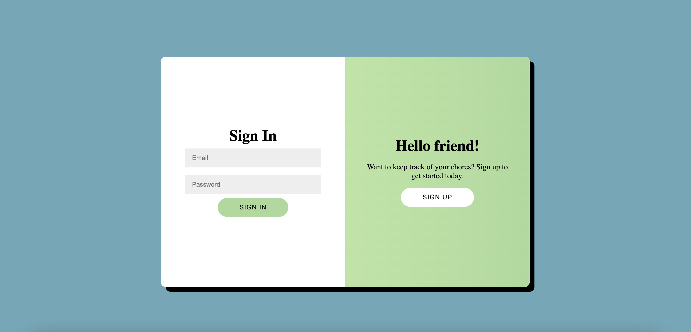
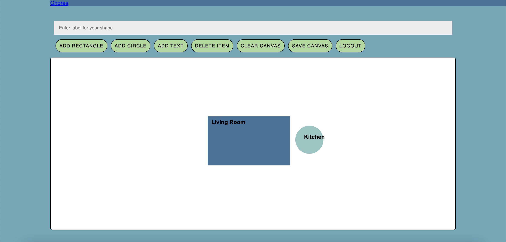
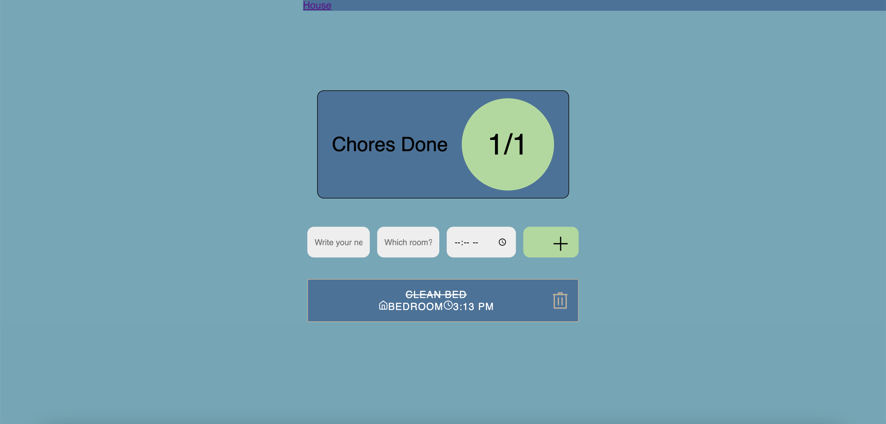

# :broom: :bed: Clean Dorm

Welcome to Clean Dorm, a website that allows users to login/register for an account, create a blueprint of your living space, and add tasks for each room!

### BroncoHacks 2025 Team Members:
- Melvin Gitbumrungsin
- Rob Ranit
- Allison Ly

## :computer: [Demo Video](https://youtu.be/T2hBC-pn0T4)

## :gear: Tools/Resources
- React JS
- HTML/CSS
- Javascript
- Konva
- Firebase
- Visual Studio Code
- GitHub
- Flaticon

## :camera: Website Features
1. Login/Register Page

  
  
2. Canvas to create blueprint

  
  
3. Chores page to add tasks for each page

  

